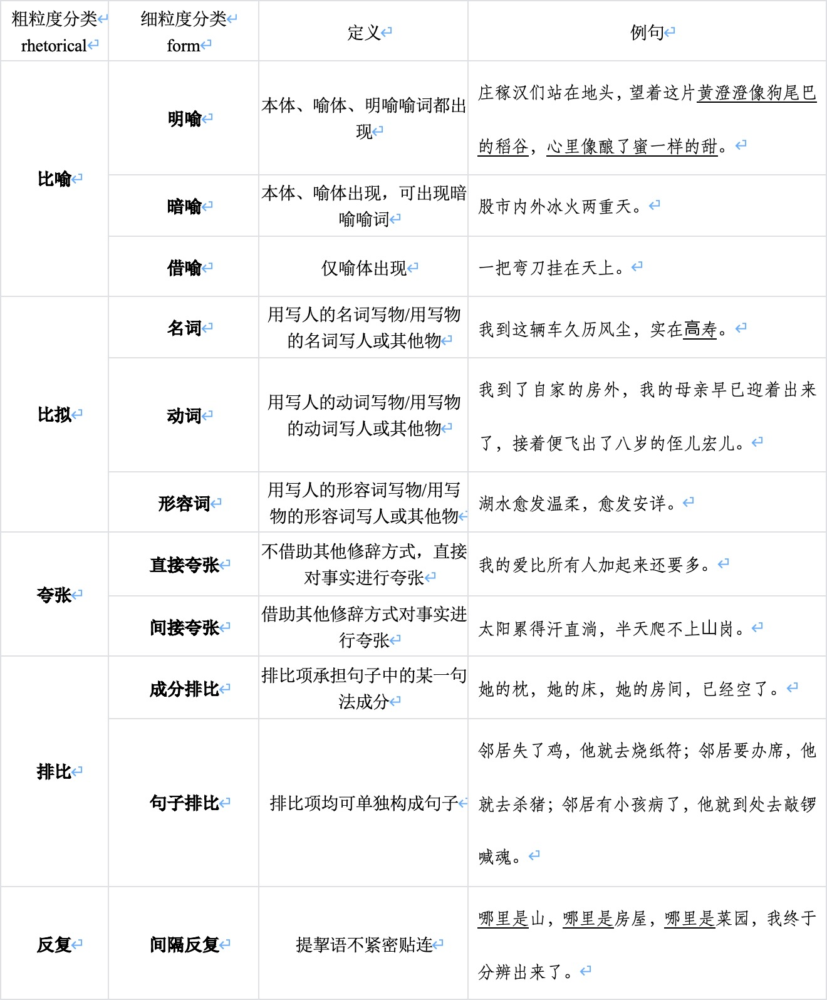
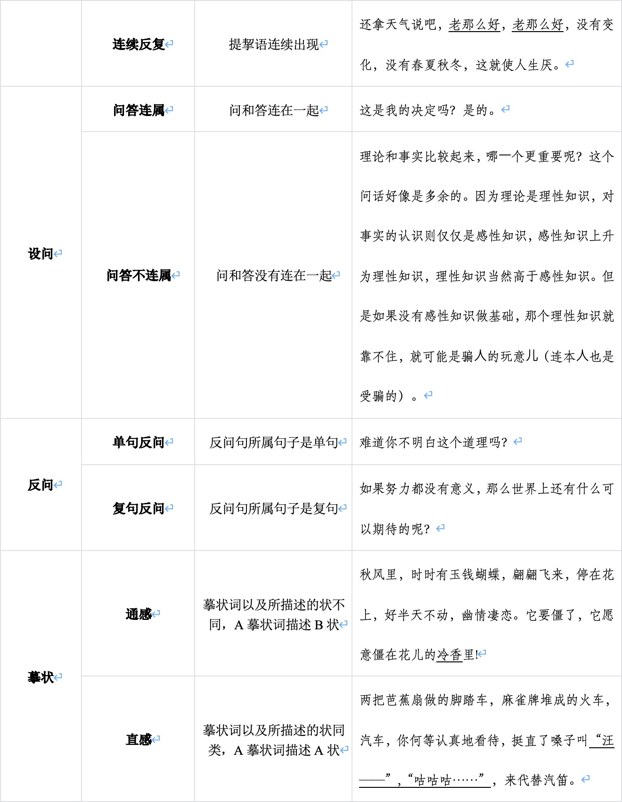
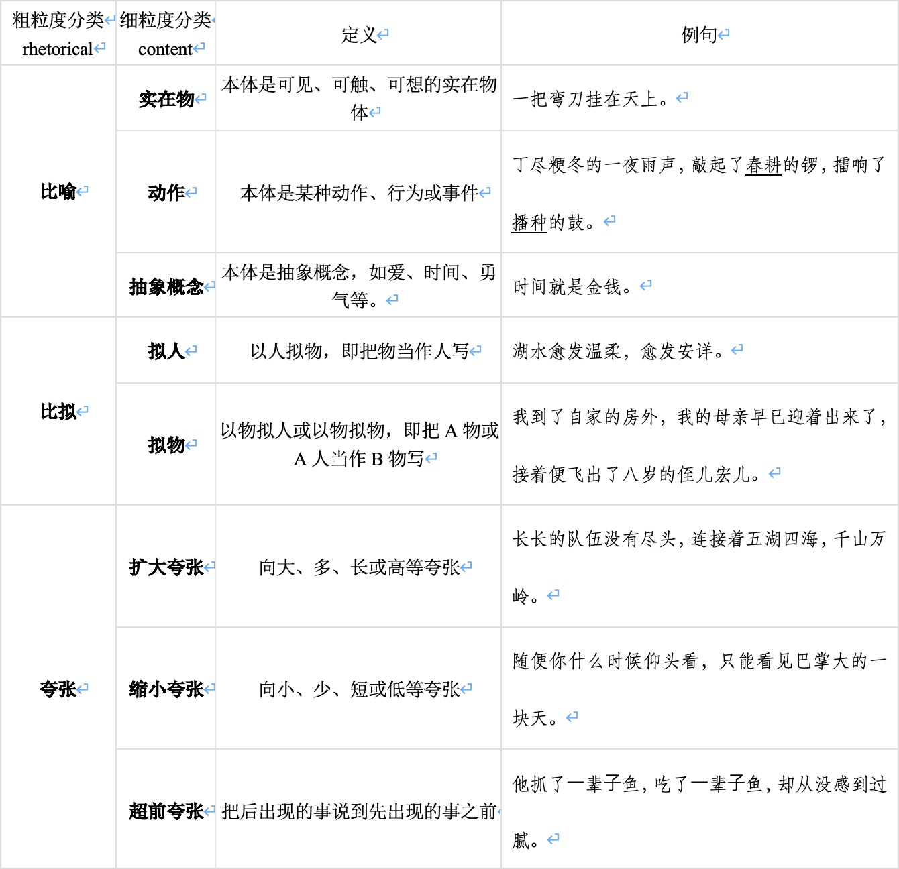
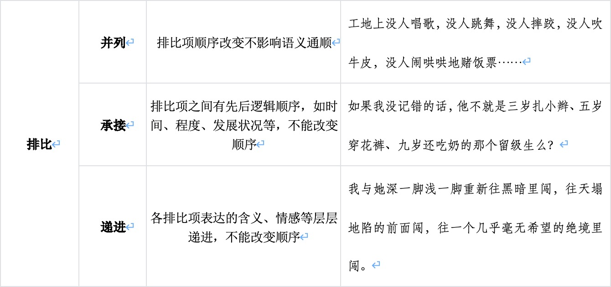
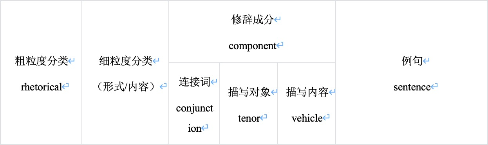
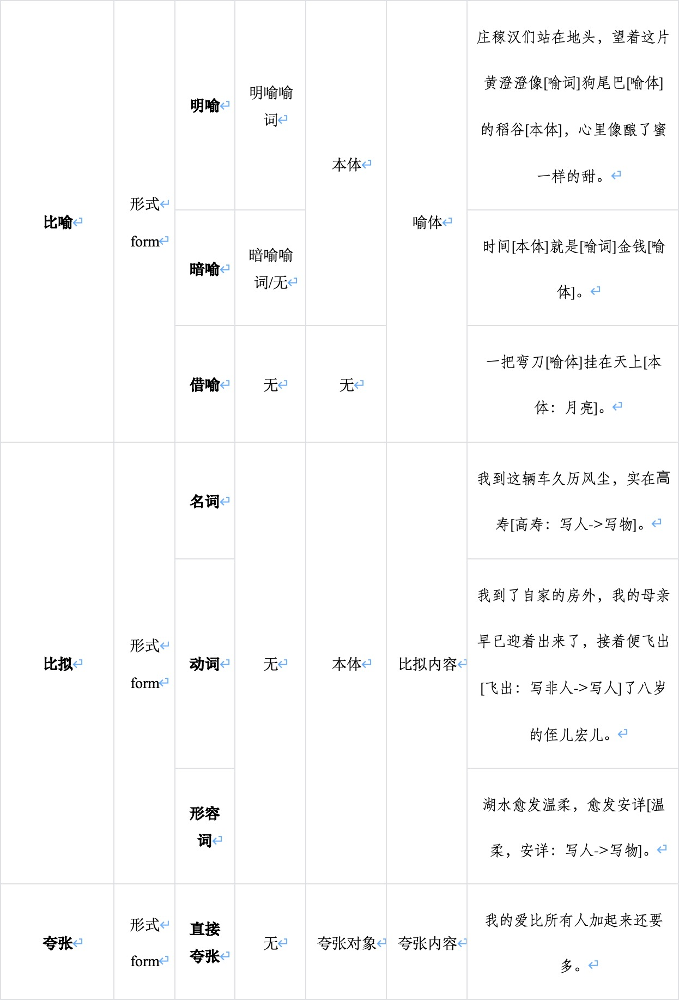

# CERRE-2025CCL
CCL2025 Chinese Essay Rhetoric Recognition Evaluation


## 更新

[2024/12/30] 评测任务基本信息发布。

[2025/03/04] 更新评测任务信息、[报名链接](https://wj.qq.com/s2/18493452/6a88/)；我们将在2025年3月底前发布训练集。

[2025/03/30] 发布训练集、更新部分评测任务信息。

[2025/04/15] 更新各赛道评价标准、发布测试代码。

## 声明

  本次比赛获得的数据只限于本次比赛，禁止商用，有科研需求请联系组织者。

## 注意事项

  在计算最终成绩时将综合考虑三个track的分数，对于没有参加某个track的队伍，将按照该track的baseline分数进行加权，从而计算总分数。

## 组织者与联系方式

  任务组织者：陆玉江（华东师范大学计算机科学与技术学院），刘诺纬（华东师范大学计算机科学与技术学院），任育培（华东师范大学计算机科学与技术学院），朱奕澄（华东师范大学中国语言文学系），兰曼（华东师范大学计算机科学与技术学院），柏晓鹏（华东师范大学中国语言文学系），徐默凡（华东师范大学中国语言文学系），廖庆钰（上海临冠数据科技有限公司）

  任务联系人：陆玉江（华东师范大学，yujianglu@stu.ecnu.edu.cn）

## 任务内容

  在中文作文写作中，文采作为语言表达的形式特征，其水平高低往往通过各类修辞的运用表现出来。因此，对作文中修辞格运用的识别和理解，不仅反应了作文的文采水平和语言表达能力，对于帮助教师评估作文质量，指导学生提升语言表达能力也有重要意义。近年来，针对作文修辞识别的研究通常使用特征匹配对齐等方法，从句子结构、语义信息等语言学特征角度进行排比和比喻的粗粒度识别，或者设计模型结构针对明喻这单一的修辞手法进行识别。针对多层次的修辞类型定义，已经有少量研究开始探索对比喻、比拟、夸张、排比这4种修辞进行细粒度类型识别和成分抽取。

  作为2024年CCL第一届中小学生修辞识别评测的延续，本次评测的数据集同样来自真实教学场景中汉语为母语的中小学作文（由扫描全能王蜜蜂家校提供作文OCR识别），作文体裁涵盖记叙文和议论文等文体。与第一届评测相比，具有以下不同：1）修辞格类型除了比喻、比拟、夸张、排比，本次评测还增加了反复、设问、反问、摹状等4种类型，扩充了更多语言表达的形式；2）上届评测仅在句子级进行识别，本次评测以段落文档级进行识别，更适合跨句群的修辞形式。


  本次评测包涵8种修辞格类型：比喻、比拟、夸张、排比、反复、设问、反问、摹状，对给定段落文档进行以下3个赛道的识别和抽取：

1、中文作文修辞形式类型识别

2、中文作文修辞内容类型识别

3、中文作文修辞成分抽取

其中赛道1在上述8种修辞格上进行识别，赛道2和3在比喻、比拟、夸张、排比4种高频修辞格上进行识别和抽取。


## 赛道1：中小学作文修辞形式类型识别

### 任务描述

  本赛道以文档为基本单位，将修辞手法按粗粒度分类为：比喻、比拟、夸张、排比、反复、设问、反问、摹状等8种粗粒度类型和其它（或无修辞），共计9类；同时，每类修辞从形式角度进一步细粒度分类为如下18种类型和其它（或无修辞），共计19类：

（1）	针对比喻修辞，从形式角度按修辞成分的显隐分类成明喻、暗喻和借喻这3种形式；

（2）	针对比拟修辞，从形式角度按标志比拟成分的词性分类成名词、动词、形容词这3种形式；

（3）	针对夸张修辞，从形式角度按夸张的方式分类成直接夸张和间接夸张这2种形式；

（4）	针对排比修辞，从形式角度按排比项的成分分类成成分排比和句子排比这2种形式；

（5）	针对反复修辞，从形式角度按提挈语是否贴连分成间隔反复和连续反复这2种形式；

（6）	针对设问修辞，从形式角度按问与答之间的跨度分类成问答连属和问答不连属这2种形式；

（7）	针对反问修辞，从形式角度按反问句类型分类成单句反问和复句反问这2种形式；

（8）	针对摹状修辞，从形式角度按摹状词与所描述的状的对应关系分类成通感和直感这2种形式。

### 任务定义

  通常，一个文档中可能包含多种修辞手法。这个修辞形式类型识别是一个多标签分类问题，预测一个文档使用了哪些类型的修辞，以及形式上的细粒度修辞类型。本赛道任务共定义9种粗粒度修辞类型（含其它）和19种修辞形式类型（含其它）。具体定义及示例如下表。
  



### 数据样例

```json
{
  "documentIdx": 0,
  "document": "一阵微风掠过。庄稼汉们站在地头，望着这片黄澄澄像狗尾巴的稻谷。每个人都开心地笑了起来。",
  "sentenceList":[
    "一阵微风掠过。"
    "庄稼汉们站在地头，望着这片黄澄澄像狗尾巴的稻谷。"
    "每个人都开心地笑了起来。"
  ]
  "rhetoricItems":[
    {
      "sentenceIdx": [1], 
      "rhetoricList": [
        {
          "rhetoric": "比喻",
          "form": "明喻"
        }
      ] 
    }
  ]
}
```

  字段包括具体文档ID、文档内容、分句列表、修辞项列表，其中修辞项包括修辞涉及的分句ID列表、粗粒度分类、形式角度细粒度分类。

### 评测数据集

  该赛道的数据来源于中学生作文数据，各项数据分布如表所示。 

| 数据集（Data Set）  |        文档数（documents）        |
| :-----------------: | :-------------------------------: |
| 训练集（Train Set） |              约150个              |
| 盲测集（Test Set）  | 约20000个 |

### 评价标准

  总分由粗粒度、形式细粒度、修辞句组定位三个部分构成，具体计算方式如下：

$$
F_1=0.3\times F_1^{\text{rhetoric}}+0.7\times F_1^{\text{form}} \\
S= 0.3 \times \text{IoU} + 0.7 \times F_1
$$

  其中$$F_1^{\text{rhetoric}}$$和$$F_1^{\text{form}}$$分别表示粗粒度和形式细粒度修辞类型的$$F_1$$值，$$\text{IoU}$$表示修辞句组定位的$$\text{IoU}$$值。

## 赛道2：中小学作文修辞内容类型识别

### 任务描述

  作文文采评估和作文批改不仅需要理解修辞类型，还需要理解修辞运用的内容类型。本赛道以文档为基本单位，针对比喻、比拟、夸张、排比这4种粗粒度类型，进一步从内容角度进行如下的修辞细粒度识别：
  
（1）	针对比喻修辞，从内容角度按本体的性质分类成实在物、动作和抽象概念3种内容类型；

（2）	针对比拟修辞，从内容角度按喻体的性质分类成拟人和拟物等2种内容类型；

（3）	针对夸张修辞，从内容角度按夸张的方向分类成扩大夸张、缩小夸张和超前夸张等3种内容；

（4）	针对排比修辞，从内容角度按排比项间的关系分类成并列、承接和递进等3种内容。

### 任务定义

  通常，一个文档中可能包含多种修辞手法。这个修辞内容类型识别是一个多标签分类问题，给定一个文档，预测使用了哪些修辞类型，以及细粒度内容类型分类。本赛道任务共定义5种粗粒度修辞类型（含其它）和11种修辞内容类型。具体定义及示例如下表。




### 数据样例

```json
{
  "documentIdx": 0,
  "document": "一阵微风掠过。庄稼汉们站在地头，望着这片黄澄澄像狗尾巴的稻谷。每个人都开心地笑了起来。",
  "sentenceList":[
    "一阵微风掠过。"
    "庄稼汉们站在地头，望着这片黄澄澄像狗尾巴的稻谷。"
    "每个人都开心地笑了起来。"
  ]
  "rhetoricItems":[
    {
      "sentenceIdx": [1], 
      "rhetoricList": [
        {
          "rhetoric": "比喻",
          "content": "实在物"
        }
      ] 
    }
  ]
}
```

  字段包括具体文档ID、文档内容、分句列表、修辞项列表，其中修辞项包括修辞涉及的分句ID列表、粗粒度分类、内容角度细粒度分类。

### 评测数据集

  该赛道的数据来源于中学生作文数据，各项数据分布如表所示。 

| 数据集（Data Set）  |        文档数（documents）        |
| :-----------------: | :-------------------------------: |
| 训练集（Train Set） |              约150个              |
| 盲测集（Test Set）  | 约20000个 |

### 评价标准

  总分由粗粒度、内容细粒度、修辞句组定位三个部分构成，具体计算方式如下：

$$
F_1=0.3\times F_1^{\text{rhetoric}}+0.7\times F_1^{\text{content}} \\
S= 0.3 \times \text{IoU} + 0.7 \times F_1
$$

  其中$$F_1^{\text{rhetoric}}$$和$$F_1^{\text{form}}$$分别表示粗粒度和内容细粒度修辞类型的$$F_1$$值，$$\text{IoU}$$表示修辞句组定位的$$\text{IoU}$$值。

## 赛道3：中小学作文修辞成分抽取

### 任务描述

  修辞成分包含描写对象、连接词和描写内容，抽取修辞成分有助于深入理解作文的语言表达能力。本赛道以文档作为基本单位，针对比喻、比拟、夸张、排比这4种粗粒度类型，从形式角度定义如下的修辞成分：
  
（1）针对比喻修辞，对于明喻形式，修辞成分包括连接词（明喻喻词）、描写对象（本体）和描写内容（喻体）；对于暗喻形式，修辞成分包括连接词（暗喻喻词/无）、描写对象（本体）和描写内容（喻体）；对于借喻形式，修辞成分包括描写内容（喻体）；

（2）针对比拟修辞，不论形式如何，修辞成分都包括描写对象（本体）和描写内容（比拟内容）；

（3）针对夸张修辞，不论形式如何，修辞成分都包括描写对象（夸张对象）和描写内容（夸张内容）；

（4）针对排比修辞，不论形式如何，修辞成分都包括连接词（排比结构）。

### 任务定义

  本赛道任务给定一个文档作为输入，抽取出该文档包含的修辞形式和修辞成分（连接词、描写对象和描写内容）。具体定义及示例如下表。





### 数据样例

```json
{
  "documentIdx": 0,
  "document": "一阵微风掠过。庄稼汉们站在地头，望着这片黄澄澄像狗尾巴的稻谷。每个人都开心地笑了起来。",
  "sentenceList":[
    "一阵微风掠过。"
    "庄稼汉们站在地头，望着这片黄澄澄像狗尾巴的稻谷。"
    "每个人都开心地笑了起来。"
  ]
  "rhetoricItems":[
    {
      "sentenceIdx": [1], 
      "componentList": [
        {
          "rhetorical": "比喻",
          "form": "明喻",
          "conjunction": ["像"],
          "conjunctionBeginIdx": [16],
          "conjunctionEndIdx": [16],
          "tenor": ["稻谷"],
          "tenorBeginIdx": [21],
          "tenorEndIdx": [22],
          "vehicle": ["狗尾巴"]
          "vehicleBeginIdx": [17],
          "vehicleEndIdx": [19]
        }
      ]
 
    }
  ]
}
```

### 评测数据集

  该赛道的数据来源于中学生作文数据，各项数据分布如表所示。 

| 数据集（Data Set）  |        文档数（documents）        |
| :-----------------: | :-------------------------------: |
| 训练集（Train Set） |              约150个              |
| 盲测集（Test Set）  | 约20000个 |

### 评价标准

  总分由连接词、描写对象、描写内容和修辞句组定位四个部分构成，具体计算方式如下：

$$
F_1=\frac{1}{3}\times F_1^{\text{conjunction}}+\frac{1}{3}\times F_1^{\text{tenor}}+\frac{1}{3}\times F_1^{\text{vehicle}} \\
S= 0.3 \times \text{IoU} + 0.7 \times F_1
$$

  其中$$F_1^{\text{conjunction}}$$、$$F_1^{\text{tenor}}$$和$$F_1^{\text{vehicle}}$$分别表示连接词、描写对象和描写内容的$$F_1$$值，$$\text{IoU}$$表示修辞句组定位的$$\text{IoU}$$值。
